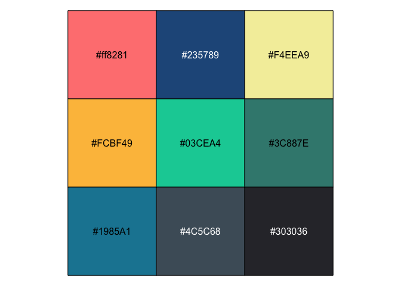
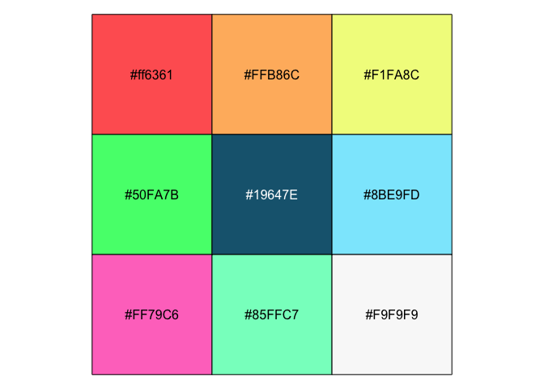
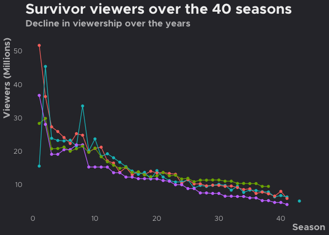
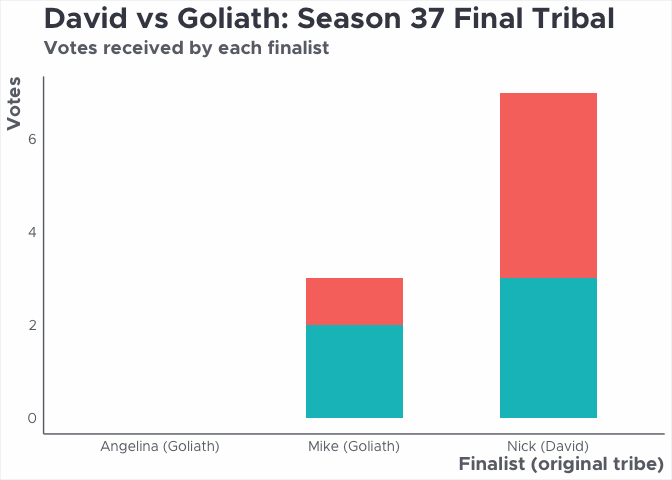
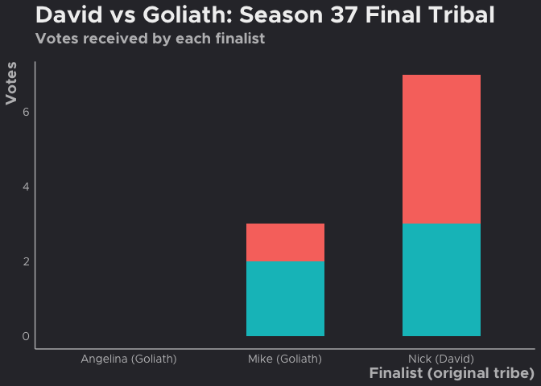
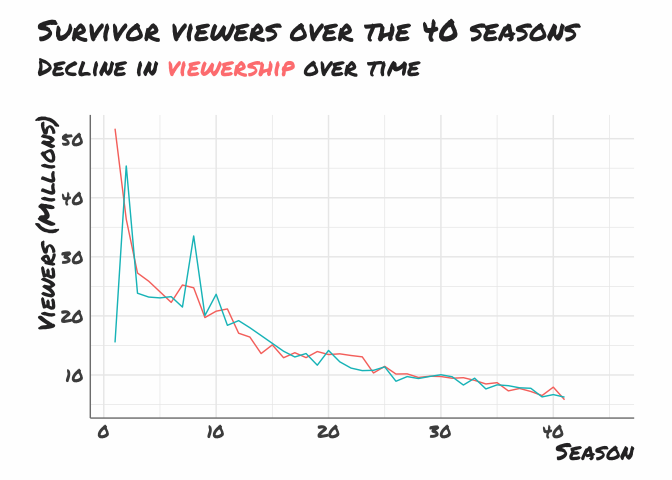
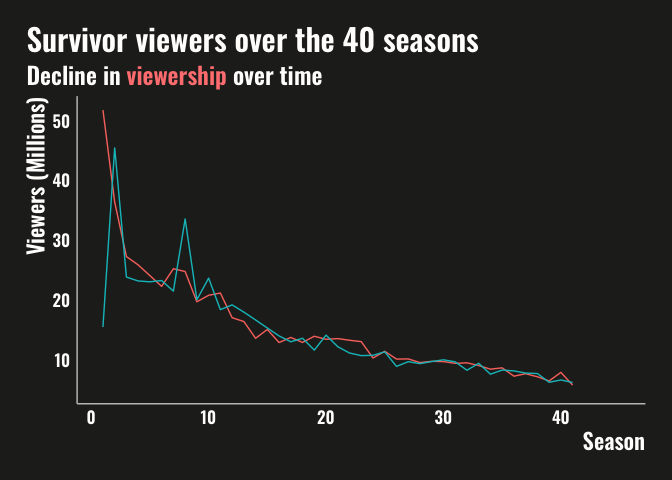

<!-- README.md is generated from README.Rmd. Please edit that file -->

```{r, include = FALSE}
knitr::opts_chunk$set(
  collapse = TRUE,
  comment = "#>",
  fig.path = "man/figures/README-",
  out.width = "100%",
  fig.align = "center"
)

```

# emwthemes

<!-- badges: start -->

[](https://github.com/emmarshall/emwthemes/actions/workflows/R-CMD-check.yaml)

<!-- badges: end -->

This is a package for personal use. 

## Installation

You can install the development version of emwthemes from [GitHub](https://github.com/) with:

``` r
# install.packages("devtools")
devtools::install_github("emmarshall/emwthemes")
```

## Package functions

**`update_geom_fonts_em`:** Update font defaults for text geoms to use playful font [Architects Daughter](https://fonts.google.com/specimen/Architects+Daughter)

**`scale_x_comma`:** formatted X-axis scale for **comma** label formats

**`scale_x_percent`:** formatted X-axis scale for **percent** label formats

**`scale_y_comma`:** formatted Y-axis scale for **comma** label formats

**`scale_y_percent`:** formatted Y-axis scale for **percent** label formats

## Fonts & Colors

See [vignette]().

Themes use two different color palette:

```{r colors, eval=FALSE}
scales::show_col(emwthemes:::emw_pal)
scales::show_col(emwthemes:::dark_pal)
```

### Bright Color Palette (default for `theme_emw()`)


### Bright Color Palette (default for `theme_emw_dark()`)

### Discrete and Continuous Scale

**`scale_color_em`:** Discrete color & fill scales based on a bright palette

**`scale_fill_em`:** Discrete color & fill scales based on a bright palette

### Scale functions

# Examples

You can find the code for all the examples below in the ["Examples" Vignette]() on the [Package Website]().


## Examples

```{r survivor-viewers, messages=FALSE, warning=FALSE, eval=TRUE}

library(emwthemes)
library(ggplot2)
library(extrafont)
library(survivoR)
library(stringr)
library(dplyr)
library(tidyr)
loadfonts(quiet = TRUE)

line <- season_summary |> 
  filter(version == "US") |> 
  select(season, viewers_premiere, viewers_finale, viewers_reunion, viewers_mean)  |> 
  pivot_longer(cols = -season, names_to = "episode", values_to = "viewers") |> 
  mutate(
    episode = str_to_title(str_replace(episode, "viewers_", ""))
  ) |> 
  ggplot(aes(x = season, y = viewers, colour = episode)) +
  geom_line() +
  geom_point(size = 1.5) +
  labs(
    title = "Survivor viewers over the 40 seasons",
    subtitle = "Decline in viewership over the years",
    x = "Season",
    y = "Viewers (Millions)",
    colour = "Episode"
  ) +
  theme_emw() 
```


## Dark Theme 

```{r survivor-viewers-dark, messages=FALSE, warning=FALSE, eval=FALSE}

line +
  theme_emw_dark()

```



## Bar Charts


```{r survivor-bar, message=FALSE, warning=FALSE, eval=TRUE}
library(glue)
ssn <- 37
labels <- castaways  |> 
  filter(
    season == ssn,
    str_detect(result, "Sole|unner")
  ) |> 
  mutate(label = glue("{castaway} ({original_tribe})")) |> 
  select(label, castaway)
 
bar <- jury_votes |> 
  filter(season == ssn) |> 
  left_join(
    castaways |> 
      filter(season == ssn) |> 
      select(castaway, original_tribe),
    by = "castaway"
  ) |> 
  group_by(finalist, original_tribe) |> 
  summarise(votes = sum(vote)) |> 
  left_join(labels, by = c("finalist" = "castaway")) |> 
    ggplot(aes(x = label, y = votes, fill = original_tribe)) +
      geom_bar(stat = "identity", width = 0.5) +
      labs(
        x = "Finalist (original tribe)",
        y = "Votes",
        fill = "Original\ntribe",
        title = "David vs Goliath: Season 37 Final Tribal",
        subtitle = "Votes received by each finalist"
      ) +
  theme_emw(with.axis.line = TRUE) 

```





```{r bar-dark, eval=FALSE}

bar +
  theme_emw_dark(with.axis.line = TRUE) 
```




### Using `theme_em()` with `MonaLisa` font and `md=TRUE`

### Alternate, more professional option with built in ability to use `ggtext::markdown_elements`

Using `theme_em` to print a scatter plot with width = 12 inches & height = 8 inches and the `md = TRUE` argument to use `ggtext::element_markdown()` instead of `element_text()` for text elements, in this case the subtitle:

```{r line-me, eval=TRUE}
line_md <- season_summary |> 
  filter(version == "US") |> 
  select(season, viewers_premiere, viewers_finale)  |> 
  pivot_longer(cols = -season, names_to = "episode", values_to = "viewers") |> 
  mutate(
    episode = str_to_title(str_replace(episode, "viewers_", ""))
  ) |> 
  ggplot(aes(x = season, y = viewers, colour = episode)) +
  geom_line() +
  labs(
    title = "Survivor viewers over the 40 seasons",
    subtitle = "Decline in <span style = 'color:#ff8281;'>viewership</span> over time",
    x = "Season",
    y = "Viewers (Millions)",
    color = "Episode"
  ) 
```

```{r line-main, eval=FALSE}
line_md +
  theme_em(md = TRUE) 

```



```{r line-dark, eval=TRUE}
line_md +
  theme_em_dark(md = TRUE,
                with.line = TRUE) 

```



