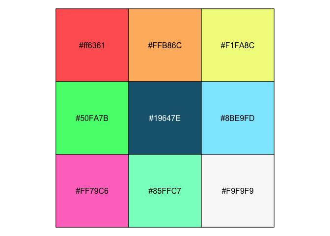
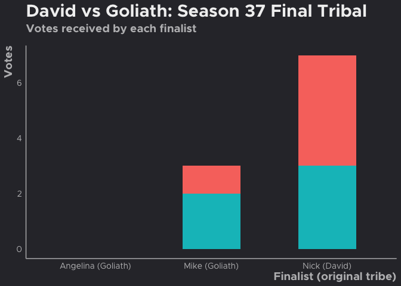
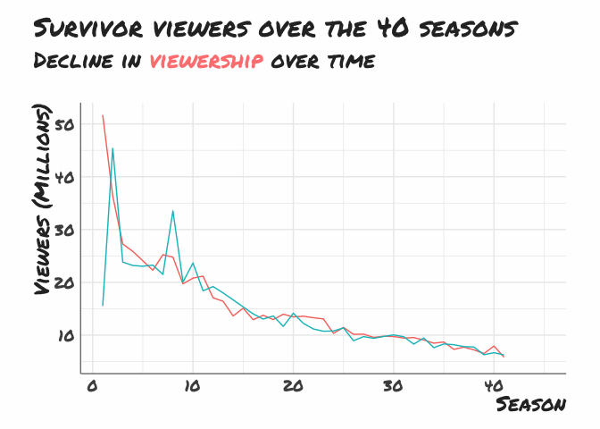
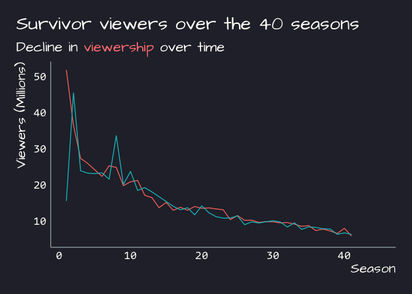

emwthemes personal package
================
Emma Marshall

<!-- README.md is generated from README.Rmd. Please edit that file -->

# emwthemes

<!-- badges: start -->

[](https://github.com/emmarshall/emwthemes/actions/workflows/R-CMD-check.yaml)

<!-- badges: end -->

This is a package for personal use.

## Installation

You can install the development version of emwthemes from
[GitHub](https://github.com/) with:

``` r
# install.packages("devtools")
devtools::install_github("emmarshall/emwthemes")
```

## Package functions

**`update_geom_fonts_em`:** Update font defaults for text geoms to use
playful font [Architects
Daughter](https://fonts.google.com/specimen/Architects+Daughter)

**`add_logo`:** easily add logo to plot object

**`link_to_img`:** processes image from url for use with `ggimage()`

## Fonts & Colors

See [vignette]().

Themes use two different color palette:

``` r
scales::show_col(emwthemes:::emw_pal)
scales::show_col(emwthemes:::dark_pal)
scaled::show_col(emwthemes:::unl_pal)
```

### Personal Color Palette (default for `theme_emw()`)

<figure>

<figcaption aria-hidden="true">Personal Scale colors</figcaption>
</figure>

### Bright Color Palette (default for `theme_emw_dark()`)

<figure>

<figcaption aria-hidden="true">Bright Scale colors</figcaption>
</figure>

### Discrete and Continuous Scale

**`scale_color_em`:** Discrete color & fill scales based on a bright
palette

**`scale_fill_em`:** Discrete color & fill scales based on a bright
palette

### Scale functions

# Examples

You can find the code for all the examples below in the [“Examples”
Vignette]() on the [Package Website]().

## Examples

``` r

library(emwthemes)
library(ggplot2)
library(extrafont)
#> Registering fonts with R
library(survivoR)
library(stringr)
library(dplyr)
#> 
#> Attaching package: 'dplyr'
#> The following objects are masked from 'package:stats':
#> 
#>     filter, lag
#> The following objects are masked from 'package:base':
#> 
#>     intersect, setdiff, setequal, union
library(tidyr)
loadfonts(quiet = TRUE)

line <- season_summary |> 
  filter(version == "US") |> 
  select(season, viewers_premiere, viewers_finale, viewers_reunion, viewers_mean)  |> 
  pivot_longer(cols = -season, names_to = "episode", values_to = "viewers") |> 
  mutate(
    episode = str_to_title(str_replace(episode, "viewers_", ""))
  ) |> 
  ggplot(aes(x = season, y = viewers, colour = episode)) +
  geom_line() +
  geom_point(size = 1.5) +
  labs(
    title = "Survivor viewers over the 40 seasons",
    subtitle = "Decline in viewership over the years",
    x = "Season",
    y = "Viewers (Millions)",
    colour = "Episode"
  )
```

<figure>

<figcaption aria-hidden="true">Example plot with
<code>theme_emw()</code></figcaption>
</figure>

## Dark Theme

``` r

line +
  theme_emw_dark()
```

<figure>

<figcaption aria-hidden="true">Example plot with
theme_emw_dark()</figcaption>
</figure>

``` r

line +

  theme_unl_dark()
```


## Bar Charts

``` r
library(glue)
ssn <- 37
labels <- castaways  |> 
  filter(
    season == ssn,
    str_detect(result, "Sole|unner")
  ) |> 
  mutate(label = glue("{castaway} ({original_tribe})")) |> 
  select(label, castaway)
 
bar <- jury_votes |> 
  filter(season == ssn) |> 
  left_join(
    castaways |> 
      filter(season == ssn) |> 
      select(castaway, original_tribe),
    by = "castaway"
  ) |> 
  group_by(finalist, original_tribe) |> 
  summarise(votes = sum(vote)) |> 
  left_join(labels, by = c("finalist" = "castaway")) |> 
    ggplot(aes(x = label, y = votes, fill = original_tribe)) +
      geom_bar(stat = "identity", width = 0.5) +
      labs(
        x = "Finalist (original tribe)",
        y = "Votes",
        fill = "Original\ntribe",
        title = "David vs Goliath: Season 37 Final Tribal",
        subtitle = "Votes received by each finalist"
      ) +
  theme_emw(with.axis.line = TRUE) +
  scale_x_discrete(guide = guide_axis(n.dodge = 3))
```

<figure>

<figcaption aria-hidden="true">Example plot with
theme_emw()</figcaption>
</figure>

``` r

bar +
  theme_emw_dark(with.axis.line = TRUE) 
```

<figure>

<figcaption aria-hidden="true">Example plot with
theme_emw_dark()</figcaption>
</figure>

### Using `theme_em()` with `Oswald` font and `md=TRUE`

### Alternate, more professional option with built in ability to use `ggtext::markdown_elements`

Using `theme_em` to print a scatter plot with width = 12 inches & height
= 8 inches and the `md = TRUE` argument to use
`ggtext::element_markdown()` instead of `element_text()` for text
elements, in this case the subtitle:

``` r
line_md <- season_summary |> 
  filter(version == "US") |> 
  select(season, viewers_premiere, viewers_finale)  |> 
  pivot_longer(cols = -season, names_to = "episode", values_to = "viewers") |> 
  mutate(
    episode = str_to_title(str_replace(episode, "viewers_", ""))
  ) |> 
  ggplot(aes(x = season, y = viewers, colour = episode)) +
  geom_line() +
  labs(
    title = "Survivor viewers over the 40 seasons",
    subtitle = "Decline in <span style = 'color:#ff8281;'>viewership</span> over time",
    x = "Season",
    y = "Viewers (Millions)",
    color = "Episode"
  ) 
```

``` r
line_md +
  theme_em(md = TRUE) 
#> Warning: Removed 6 rows containing missing values or values outside the scale range
#> (`geom_line()`).
```



<figure>

<figcaption aria-hidden="true">Example plot with theme_em()</figcaption>
</figure>

``` r
line_md +
  theme_em_dark(md = TRUE,
                with.line = TRUE) 
#> Warning: Removed 6 rows containing missing values or values outside the scale range
#> (`geom_line()`).
```



<figure>

<figcaption aria-hidden="true">Example plot with
theme_em_dark()</figcaption>
</figure>
