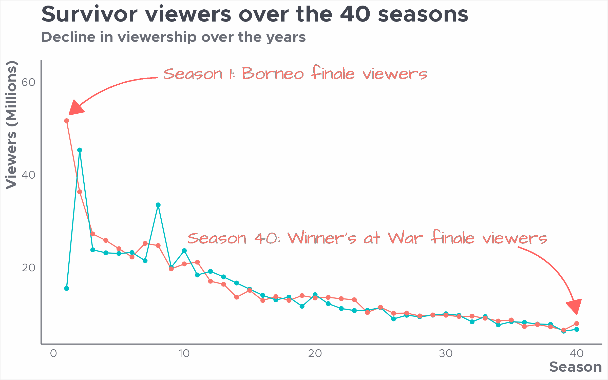
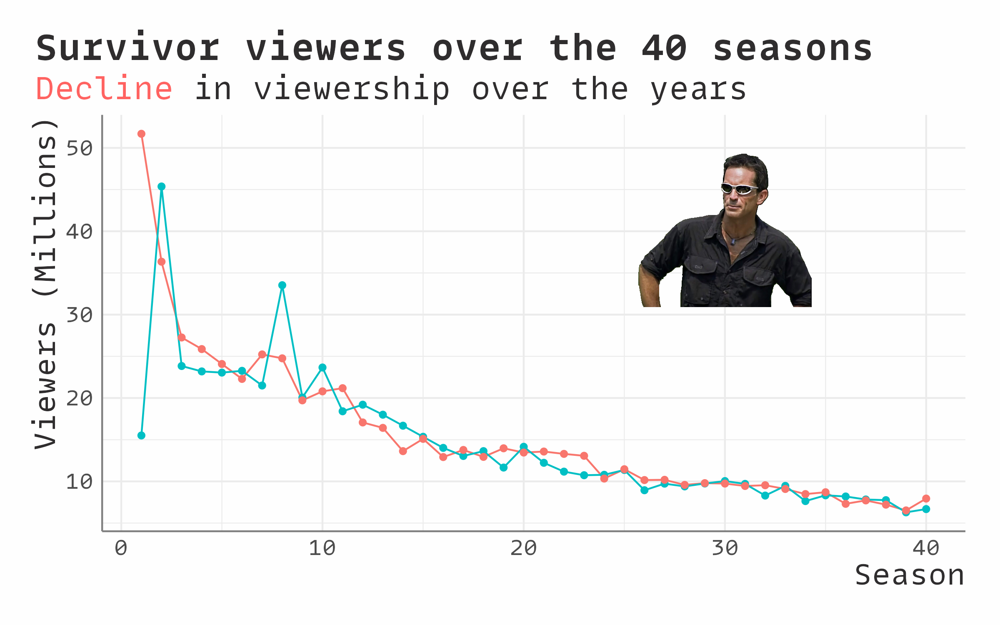

```{r setup, include = FALSE}
knitr::opts_chunk$set(
  collapse = TRUE,
  comment = "#>",
  fig.width=8, fig.height=5
)

```

## Examples

```{r example-plot, messages=FALSE, warning=FALSE, eval=FALSE}

library(emwthemes)
library(ggplot2)
library(extrafont)
library(survivoR)
library(stringr)
library(dplyr)
library(tidyr)
loadfonts(quiet = TRUE)

# Call the function to update the geom_default fonts
update_geom_fonts_emw()
# Create line chart 
season_summary |> 
  filter(version == "US",
         season < 41) |> 
  select(season, viewers_premiere, viewers_finale)  |> 
  pivot_longer(cols = -season, names_to = "episode", values_to = "viewers") |> 
  mutate(
    episode = str_to_title(str_replace(episode, "viewers_", ""))
  ) |> 
  ggplot(aes(x = season, y = viewers, colour = episode)) +
  geom_line() +
  geom_point(size = 1.5) +
   #add text labels
  geom_curve(aes(x = 8, y = 61, xend = 1.2, yend = 53), size = 0.5,  ## arrow
             arrow = arrow(length = unit(0.2, "inches"), type = "closed", ends = "last"), 
             curvature = 0.2,
             color = "#ff6361") +
  geom_curve(aes(x = 35.5, y = 24.5, xend = 40, yend = 10), size = 0.5,  ## arrow
             arrow = arrow(length = unit(0.2, "inches"), type = "closed", ends = "last"), 
             curvature = -0.3,
             color = "#ff6361") +
  geom_text(aes(x = 18.5, y = 62, label = "Season 1: Borneo finale viewers")) +
  geom_text(aes(x = 24, y = 26.5, label = "Season 40: Winner's at War finale viewers")) +
  labs(
    title = "Survivor viewers over the 40 seasons",
    subtitle = "Decline in viewership over the years",
    x = "Season",
    y = "Viewers (Millions)",
    colour = "Episode"
  ) +
  theme_emw()
 

#ggsave("line-viewers.png", device = "png", type = "cairo", width = 8, height = 5, dpi = 300)

```

{width="650"}


### Example with markdown element 

```{r example-plot-md, messages=FALSE, warning=FALSE, eval=FALSE}

library(emwthemes)
library(ggplot2)
library(extrafont)
library(survivoR)
library(stringr)
library(dplyr)
library(tidyr)
library(ggtext)
loadfonts(quiet = TRUE)

# Call the function to update the geom_default fonts
update_geom_fonts_emw()
# Create line chart 
season_summary |> 
  filter(version == "US",
         season < 41) |> 
  select(season, viewers_premiere, viewers_finale)  |> 
  pivot_longer(cols = -season, names_to = "episode", values_to = "viewers") |> 
  mutate(
    episode = str_to_title(str_replace(episode, "viewers_", ""))
  ) |> 
    mutate(label = link_to_img("https://cdn140.picsart.com/338238259100211.png", width = 100)) |> 
  ggplot(aes(x = season, y = viewers, colour = episode)) +
  geom_line() +
  geom_point(size = 1.5) +
   #add text labels
  geom_richtext(
    aes(
      x = 30,
      y = 30,
      label = label
    ),
    size = 1,
    fill = "transparent",
    label.color = NA,
    #adjust location above bar
    vjust = -0.01,
  ) +
  labs(
    title = "Survivor viewers over the 40 seasons",
    subtitle = "<span style = 'color:#ff6361'>Decline</span> in viewership over the years",
    x = "Season",
    y = "Viewers (Millions)",
    colour = "Episode"
  ) +
   theme_em(md=TRUE) 


ggsave("line-viewers-md.png", device = "png", type = "cairo", width = 8, height = 5, dpi = 300)


```


{width="650"}
